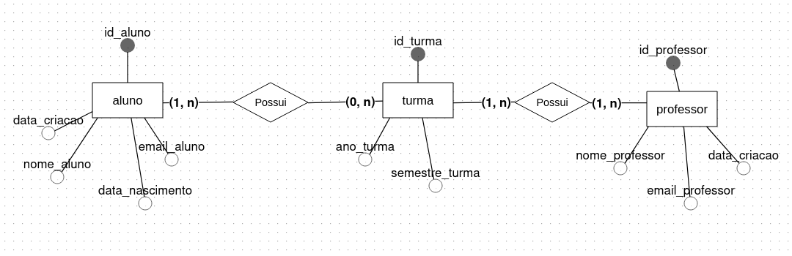

# Modelagem Diagrama Entidade-Relacionamento

O diagrama de Entidade-Relacionamento é uma forma de conseguir modelar banco de dados, através das Entidades que representam tabelas no banco de dados e Relacionamentos que são as conexões entre essas tabelas.

O exemplo de modelagem escolhido foi referente a Escola. Nesse caso, temos 3 entidades principais: Aluno, Turma e Professor.

A chave de uma entidade é equivalente a **PRIMARY KEY**, logo, cada entidade possui sua chave-primária se referindo ao ID. Os outros atributos da entidade são as **colunas complementares** das tabelas, então, cada entidade tem seu atributo de acordo com a sua necessidade.

O relacionamento entre **aluno** e **turma** possui uma cardinalidade de n,n - ou seja, um aluno pode ter 0 ou N turmas, enquanto uma turma precisa possuir 1 ou mais alunos. Nessas condições, geramos uma tabela extra para conseguir unir essa relação.

O relacionamento entre **turma** e **professor** possui também uma cardinalidade de n,n - ou seja, uma turma pode ter 1 ou mais professores, enquanto 1 professor pode ter 1 ou mais turmas. Nessa relação, também é necessário ter mais uma tabela para que seja possivel visualizar a relação.
