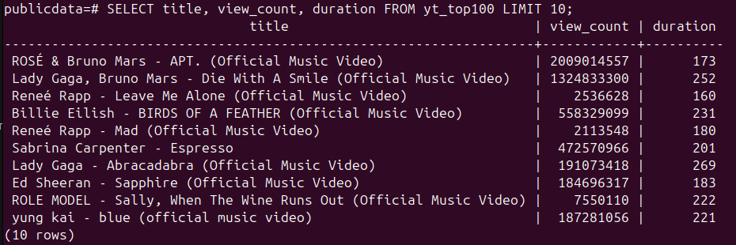
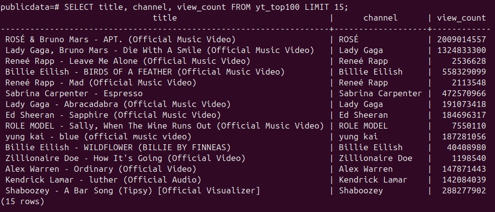

# Prática com Dataset Real

## Banco de dados importado

- [Top YouTube Music Hits 2025 - Kaggle](https://www.kaggle.com/datasets/ayeshaimran123/top-youtube-music-hits-2025?resource=download)

Foi escolhido esse dataset por contar muitas informações e caracteres textuais, o que poderia ser um desafio a ser tratado. Além disso, eu também gosto muito de música :)

## Importando no Postgresql

**Primeiro passo:** instalei o postgresql no meu computador. No meu caso, como uso Ubuntu 24.04, usei o terminal com o comando `sudo apt update
sudo apt install -y postgresql postgresql-contrib`

**Segundo passo:** decidi usar o pŕoprio terminal para fazer as consultas e mexer no banco (na dificuldade que aprendemos).
Então, usei o comando `sudo -u postgres psql` para acessar o psql, que é praticamente uma interface de terminal para visualizar os bds.

### Comandos importantes

```
    \l --lista todos os dbs.
    \conninfo --mostra informações de conexão
    \c mydb  --se conecta com o db desejado
    \dt --lista todas as tabelas
    \pset pager off --sair do modo visualização em página
```

**Terceiro passo:** Depois de baixar o csv escolhido, precisei anotar o nome de todas as colunas, pois precisei criar um novo banco e uma tabela para conseguir manipular esses dados.

```
  CREATE DATABASE publicdata;
```

Depois de criada o banco, eu criei a tabela com o comando abaixo.

```
CREATE TABLE yt_top100 (
  title                    TEXT,
  fulltitle                TEXT,
  description              TEXT,
  view_count               BIGINT,     -- os números de visualização podem ultrapassar o limite do int
  categories               TEXT,
  tags                     TEXT,
  duration                 INTEGER,
  duration_string          TEXT,
  live_status              TEXT,
  thumbnail                TEXT,
  channel                  TEXT,
  channel_url              TEXT,
  channel_follower_count   BIGINT
);
```

Acabei usando text pois ele não tem limite de tamanho. Se fosse usar VARCHAR, iria ter que adivinhar o tamanho dos dados, dessa maneira achei mais prático.

Depois disso, eu usei o comando para importar as informações para essa tabela criada.

```
\copy yt_top100 FROM '/home/gaby/Downloads/youtube-top-100-songs-2025.csv'
  WITH (FORMAT csv, HEADER, QUOTE '"', ESCAPE '"');
```

Porém, **falhou**!!

Era preciso configurar meu usuário para conseguir acessar um arquivo que está na minha home. O usuário padrão _postgres_ não tem autorização de ler meus arquivos.

Então, fechei o terminal e abri novamente, agora para criar um usuário com permissões master para conseguir acessar os arquivos.

```
sudo -u postgres psql -c "CREATE ROLE gaby LOGIN SUPERUSER;"
```

E acessei novamente o psql sem permissão sudo, através do usuário gaby.

```
psql -U gaby -d publicdata
```

E então o comando funcionou.

Logo, seguimos com as consultas.

## Criando 5 consultas diferentes

### Primeira Consulta

```
SELECT title, view_count, duration FROM yt_top100 LIMIT 10
```

Pedi para selecionar o titulo, quantidade de visualizações e duração das 10 primeiras músicas da lista.



### Segunda Consulta

```
SELECT title, channel, view_count FROM yt_top100 LIMIT 15;
```

Pedi para selecionar o titulo, canal e quantidade de visualizações das 15 primeiras músicas.


